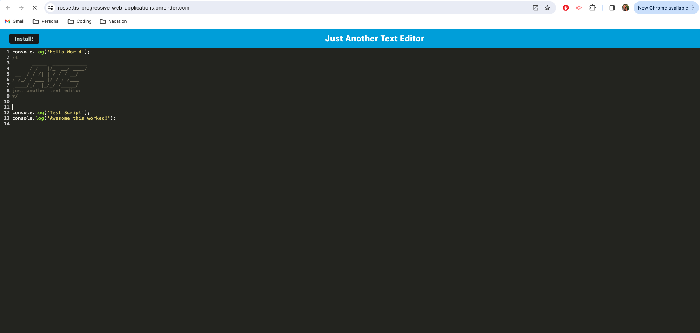

# Rossetti-s-Progressive-Web-Applications-PWA-Challenge-Text-Editor

<a name="readme-top"></a>

[![Contributors][contributors-shield]][contributors-url]

<br />
<div align="center">
<a href="https://github.com/stephenrossetti/Rossetti-s-Progressive-Web-Applications-PWA-Challenge-Text-Editor">

</a>

<h3 align="r">Progressive Web Applications (PWA) Challenge: Text Editor</h3>
<p align="center">
    Check out the app here!
<br />

<br />
<a href="https://rossetti-s-progressive-web-app-21d11213ea20.herokuapp.com/">View App on Heroku</a>
    ·
<a href="https://rossettis-progressive-web-applications.onrender.com">View App on Render</a>
    ·
<a href="https://github.com/stephenrossetti/Rossetti-s-Progressive-Web-Applications-PWA-Challenge-Text-Editor/issues">Report Bug</a>
    ·
<a href="https://github.com/stephenrossetti/Rossetti-s-Progressive-Web-Applications-PWA-Challenge-Text-Editor/issues">Request Feature</a>
  </p>
</div>


<details>
<summary>Table of Contents</summary>
<ol>
<li><a href="#overview-of-Text-Editor-PWA">Overview of Text Editor PWA</a></li>
<li><a href="#user-story">User Story</a></li>
<li><a href="#acceptance-criteria">Acceptance Criteria</a></li>
<li><a href="#getting-started">Getting Started</a><li>
<ul>
<li><a href="#prerequisites">Prerequisites</a></li>
<li><a href="#installation">Installation</a></li>
</ul>
</li>
<li><a href="#technology-used">Technology Used</a></li>
<li><a href="#usage">Usage</a></li>
<li><a href="#links">Links</a></li>
<li><a href="#contributing">Contributing</a></li>
<li><a href="#license">License</a></li>
<li><a href="#contact-us">Contact Us </a></li>
<li><a href="#credits">Credits</a></li>
<li><a href="#acknowledgments">Acknowledgments</a></li>
</ol>
</details>

## Overview of Text Editor PWA

Progressive Web Applications (PWA) Challenge: Text Editor, or Module-19's Challenge, was to build a text editor that runs in the browser. The app is a single-page application that meets the PWA criteria. Additionally, it features a number of data persistence techniques that serve as redundancy in case one of the options is not supported by the browser. The application also functions offline. This text editor was built using an existing application and implement methods for getting and storing data to an IndexedDB database, and was deployed to Render. 

Along with other skills learned in previous challenges, this challenge tested our ability to use a package called idb, which is a lightweight wrapper around the IndexedDB API, as well as webpack, service worker, manifest, and bundling js/css/html into a dist folder.

## User Story

```
AS A developer
I WANT to create notes or code snippets with or without an internet connection
SO THAT I can reliably retrieve them for later use
```

## Acceptance Criteria

```
GIVEN a text editor web application
WHEN I open my application in my editor
THEN I should see a client server folder structure
WHEN I run `npm run start` from the root directory
THEN I find that my application should start up the backend and serve the client
WHEN I run the text editor application from my terminal
THEN I find that my JavaScript files have been bundled using webpack
WHEN I run my webpack plugins
THEN I find that I have a generated HTML file, service worker, and a manifest file
WHEN I use next-gen JavaScript in my application
THEN I find that the text editor still functions in the browser without errors
WHEN I open the text editor
THEN I find that IndexedDB has immediately created a database storage
WHEN I enter content and subsequently click off of the DOM window
THEN I find that the content in the text editor has been saved with IndexedDB
WHEN I reopen the text editor after closing it
THEN I find that the content in the text editor has been retrieved from our IndexedDB
WHEN I click on the Install button
THEN I download my web application as an icon on my desktop
WHEN I load my web application
THEN I should have a registered service worker using workbox
WHEN I register a service worker
THEN I should have my static assets pre cached upon loading along with subsequent pages and static assets
WHEN I deploy to Render
THEN I should have proper build scripts for a webpack application
```

<p align="right">(<a href="#readme-top">back to top</a>)</p>

## Technology Used

- 

- 

- 

- 

- 

- 

- 

## Getting Started

How to get started with the Text Editor PWA!

### Prerequisites

- npm
- Render
- Heroku

### Installation

Instructions on how to download our app.

1. Visit our app on [Render](https://rossettis-progressive-web-applications.onrender.com) or [Heroku](https://rossetti-s-progressive-web-app-21d11213ea20.herokuapp.com/)

OR

1. Visit us @ [https://github.com/stephenrossetti](https://github.com/stephenrossetti/Rossetti-s-Progressive-Web-Applications-PWA-Challenge-Text-Editor)
2. Clone the repo
   ```sh
   git@github.com:stephenrossetti/Rossetti-s-Progressive-Web-Applications-PWA-Challenge-Text-Editor.git
   ```
3. Install NPM packages

   ```sh
   npm i
   ```

4. To run, build, or further install packages on our app choose between the following inputs defined in the package.json: start:dev, start, server, build, install, and client

   ```sh
      npm run [INPUT]
   ```

5. Run and connect

   ```sh
   http://localhost:3000
   ```

<p align="right">(<a href="#readme-top">back to top</a>)</p>

## Usage





## Links
[The URL to Render](https://rossettis-progressive-web-applications.onrender.com/)

[The URL to Heroku](https://rossetti-s-progressive-web-app-21d11213ea20.herokuapp.com/)

[The URL of the Github Repository](https://github.com/stephenrossetti/Rossetti-s-Progressive-Web-Applications-PWA-Challenge-Text-Editor)

<p align="right">(<a href="#readme-top">back to top</a>)</p>

## Contributing

Here is how you can be apart of creating Social Network API.

1. Fork the Project
2. Create your Feature Branch (`git checkout -b [BRANCH NAME]`)
3. Commit your Changes (`git commit -m 'Add my commits to main'`)
4. Push to the Branch (`git push origin main`)
5. Open a Pull Request

<p align="right">(<a href="#readme-top">back to top</a>)</p>

## License

N/A

<p align="right">(<a href="#readme-top">back to top</a>)</p>

## Contact Us

Contact me ([Stephen Rossetti](https://github.com/stephenrossetti)) if you have any questions or feedback.

<p align="right">(<a href="#readme-top">back to top</a>)</p>

## Credits

Coding help from external sources:

- Utilized Module-28-Activity (Mini-Project) as a template to complete TODOs. Included most of the functionality including, but not limited to, the configuration, service worker, manifest, PUT/GET, etc. Code was updated for challenge requirements.
- Utilized TAs for debugging help.
- Utilized class provided start code from [cautious-meme](https://github.com/coding-boot-camp/cautious-meme).

<p align="right">(<a href="#readme-top">back to top</a>)</p>

## Acknowledgments

Thanks to our resources on creating our app!

- [Visual Studio Code](https://code.visualstudio.com/)
- [Render](https://img.shields.io/badge/Render-46E3B7?style=for-the-badge&logo=render&logoColor=white)
- [Heroku](https://img.shields.io/badge/Heroku-430098?style=for-the-badge&logo=heroku&logoColor=white)
- [Static Badges](https://shields.io/badges)

<p align="right">(<a href="#readme-top">back to top</a>)</p>

[contributors-shield]:https://img.shields.io/badge/CONTRIBUTORS%20--4?style=for-the-badge&logo=gitlab&labelColor=WHITE
[contributors-url]: https://github.com/stephenrossetti/Rossetti-s-Progressive-Web-Applications-PWA-Challenge-Text-Editor/graphs/contributors